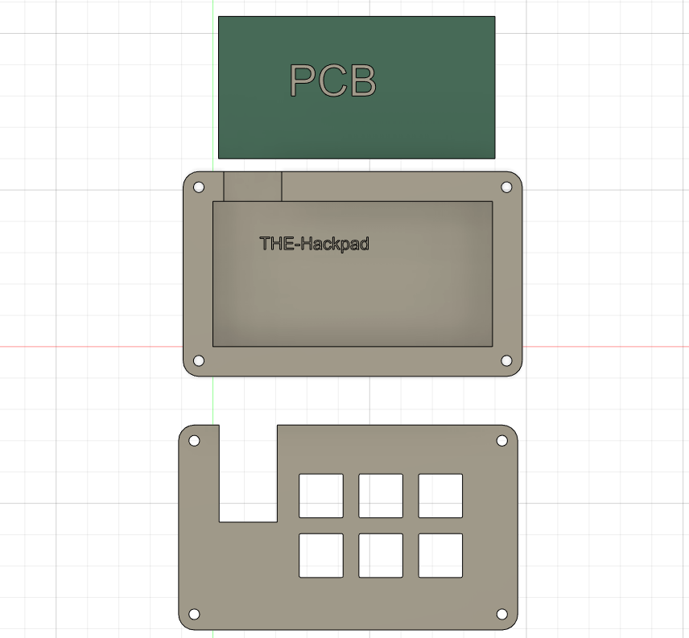
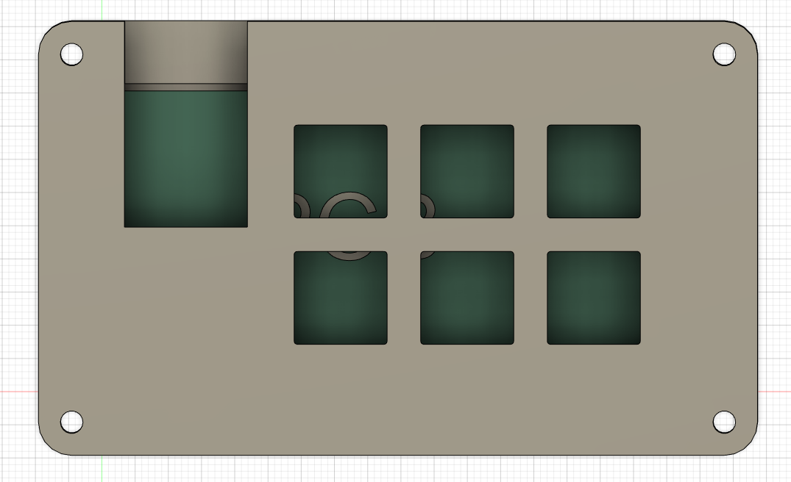
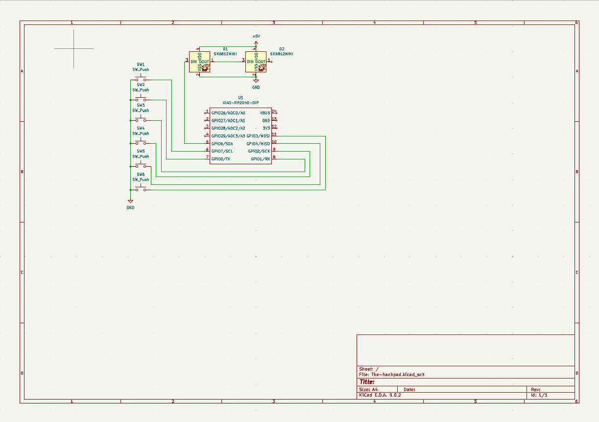
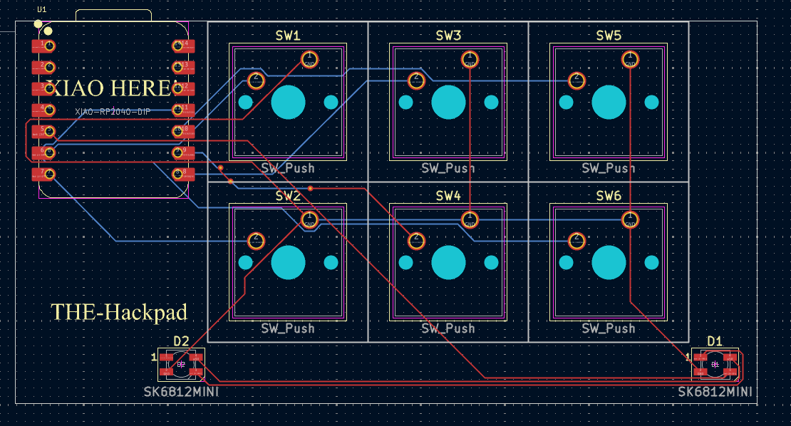

# THE-hackpad
This macropad is a six key with the intention to have the basic game controls.

# Disassembled

# Overall Hackpad

# Schematic

# PCB

# BOM
## Seeed Studio RP2040
## LED_SK6812MINI_PLCC4_3.5x3.5mm_P1.75mm
## Cherry MX 1.00 u
